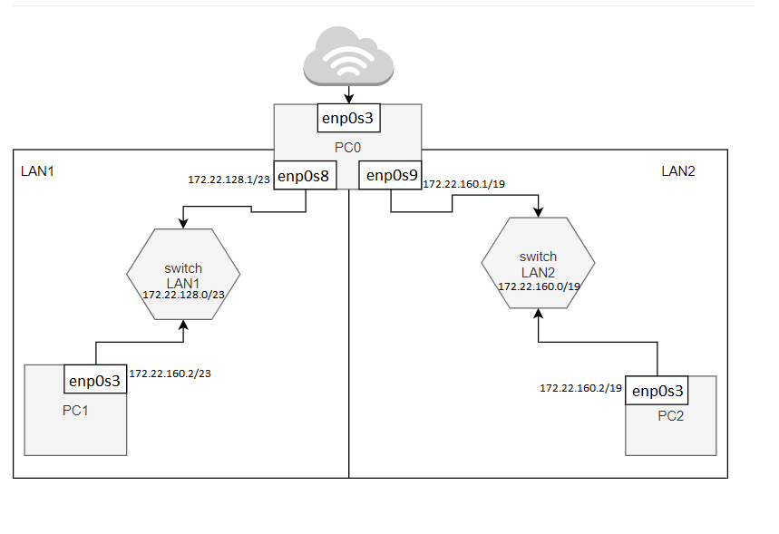

Zadanie 1
---------

1. Zaprojektuj oraz przygotuj prototyp rozwiązania z wykorzystaniem oprogramowania ``VirtualBox`` lub podobnego. 
Zaproponuj rozwiązanie spełniające poniższe wymagania:
   * Usługodawca zapewnia domunikację z siecią internet poprzez interfejs ``eth0`` ``PC0``
   * Zapewnij komunikację z siecią internet na poziomie ``LAN1`` oraz ``LAN2``
   * Dokonaj takiego podziału sieci o adresie ``172.22.128.0/17`` aby w ``LAN1`` można było zaadresować ``500`` adresów natomiast w LAN2 ``5000`` adresów    
   * Przygotuj dokumentację powyższej architektury w formie graficznej w programie ``DIA``
 

### 1)Ustalenie maski podsieci dla

    LAN1 172.22.128.0/23 dla 500 adresów (dokładnie 510)
    Lan2 172.22.160.0/19 dla 5000 adresów (dokładnie 8190)

### 2) Dodajemy adresy 
          PC0
    ip addr add 172.22.128.1/23 dev enp0s8 
    ip addr add 172.22.160.1/19 dev enp0s9
       Aktywacja
    ip link set enp0s3 up
    ip link set enp0s8 up
    ip link set enp0s9 up

          PC1
    ip addr add 172.22.128.2/23 dev enp0s3

          PC2
    ip addr add 172.22.128.2/19 dev enp0s3

### 3) Ustalamy routing 
        PC1
    ip route delete default
    up ip route add default via 172.22.128.1 dev enp0s3

        PC2
    ip route delete default
    up ip route add default via 172.22.160.1 dev enp0s3

### 4) Przekierowywanie pakietu w PC0
    echo 1 > /proc/sys/net/ipv4/ip_forward 

### 5) Dodanie reguły masquerade w PC0
    iptables -t nat -A POSTROUTING -s 172.22.128.0/23 -o enp0s3 -j MASQUERADE
    iptables -t nat -A POSTROUTING -s 172.22.160.0/19 -o enp0s3 -j MASQUERADE
     
'''
